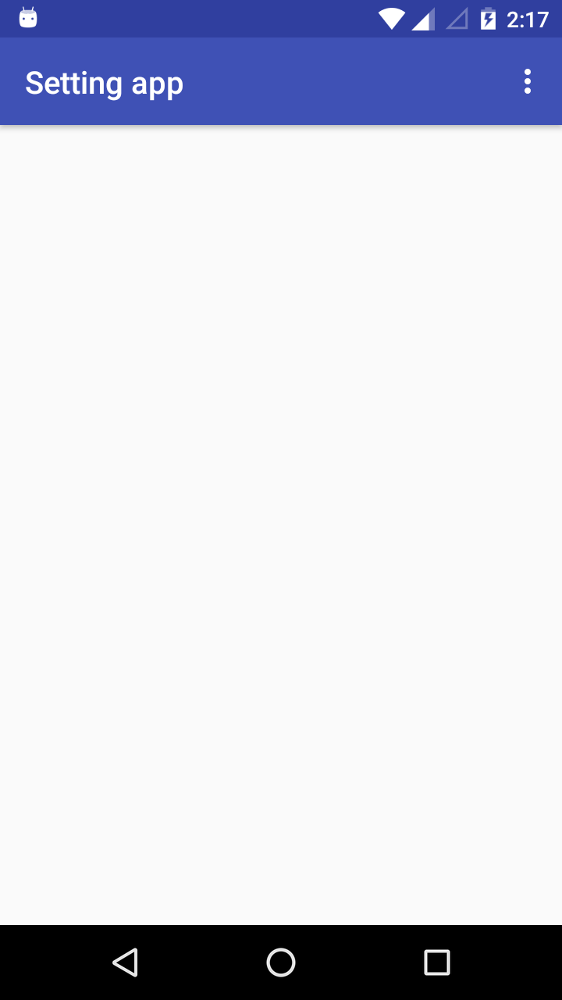
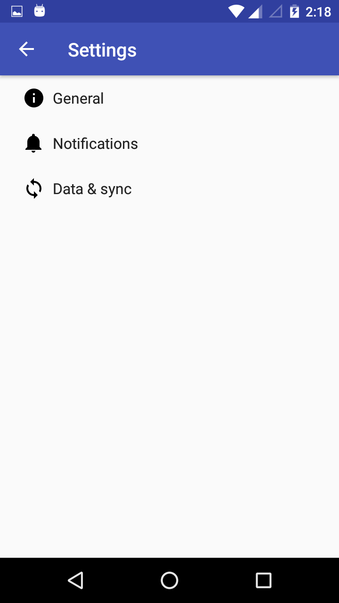
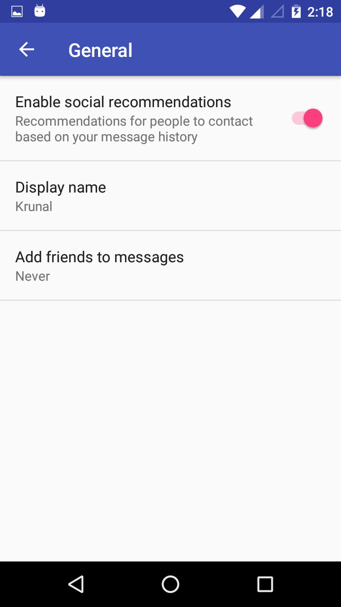
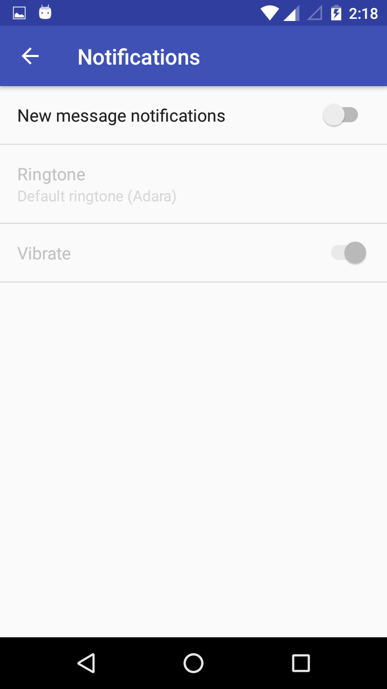
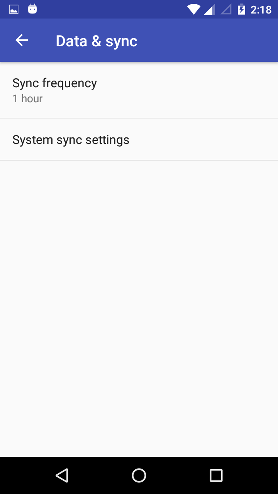

# Simple Setting app Example.

This is Simple Setting app that how to save data in SharedPreferences file in keys and values and get data from SharedPreferences file.

### Note:- 

To see setting values **Check Logs in Android Studio**.

## Screenshots:-

  

 
